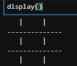
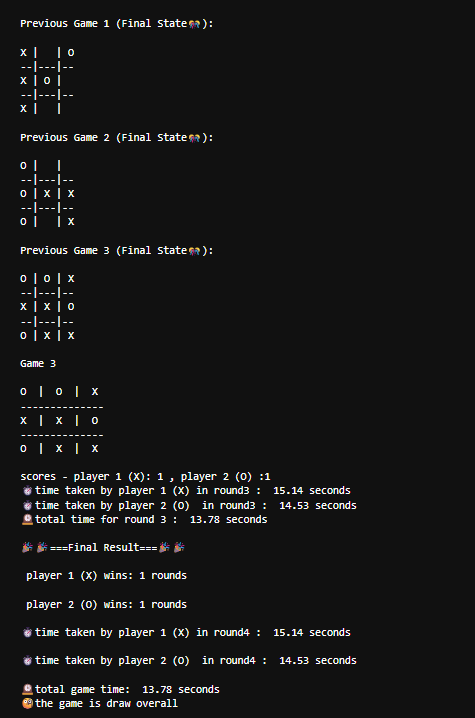
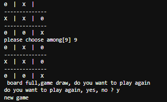

# 🎮 Tic-Tac-Toe Game

Welcome to Tic-Tac-Toe game built in Jupyter Notebook, demonstrating core programming concepts. This project showcases the power of functions, conditions, loops, and randomization to create an engaging two-player game.

## 💫Features

- *Two-Player Mode*: Play against a friend on the same device.
- *Interactive UI*: Clean and intuitive interface for placing 'X' or 'O' on the grid.
- *Win Detection*: Automatically detects and announces the winner or a draw.
- *Reset Game*: Option to reset the board and start a new game.
- *Game Timming*: Note rach round game timming .
- *3 Round Game*: Game has three rounds.
- *Score Tracking*: Keeps track of player scores across multiple rounds.

## 📁Project Structure

TicTacToe/

├──tictactoe.ipynb               # main game implementation

├── screenshots/                 # Game screenshots

        ├── img1.png         # Sample board screenshot
        
        └── img2.png
        
        └── img3.png
        
        └── img4.png
        
├── README.md                 # Project documentation

## 🖼️ScreenShots

Below are some screenshots of the Tic-Tac-Toe game in action:

Initial empty Tic-Tac-Toe board

Choose a number

Game quit by player

Three round game

## 🎯 Learning Outcomes

This project helped me practice and understand:

- Functions → breaking code into reusable parts
- Loops → for repeated gameplay flow
- Conditionals → to check winning/draw logic
- Dictionaries → for maintaining scoreboard

## 📱Contact

Contact Me:

- Email: ranakanika103@gmail.com
- LinkedIn: https://www.linkedin.com/in/kanika-rana-0681b4372/
